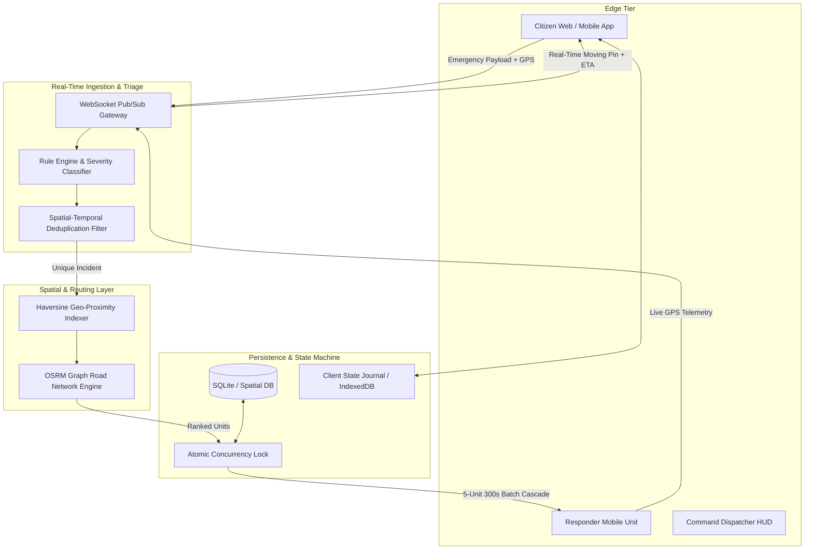

# 🛡️ Hyperlocal Emergency Response Platform
## *Advanced Geolocation Intelligence, Distributed Dispatch & Resilient Telemetry*
### **IIT-Level Technical Architecture & Jury Evaluation Dossier**

---

## 📌 Executive Engineering Summary

The **Hyperlocal Emergency Response Platform** is a distributed, fault-tolerant real-time incident coordination and vehicle telemetry system. It solves the critical **"Golden Hour" urban emergency logistics bottleneck** through automated geospatial triage, multi-batch exponential cascade dispatching, sub-meter pin mesh tracking, and real-world road graph routing.

---

## 🏛️ System Architecture

---

## 🔬 Core Algorithms & Mathematical Foundations

### 1. Spatial-Temporal Deduplication ($O(1)$ Proximity Filter)
To prevent dispatch flooding from multiple bystander reports of the same incident, incoming reports are clustered using a spatial-temporal bounding box:

$$\Delta\sigma = 2 \arcsin \left( \sqrt{\sin^2\left(\frac{\Delta\phi}{2}\right) + \cos(\phi_1)\cos(\phi_2)\sin^2\left(\frac{\Delta\lambda}{2}\right)} \right) \times R$$

- **Spatial Constraint**: $\Delta\sigma \le 200\text{ meters}$
- **Temporal Constraint**: $|t_{\text{report}} - t_{\text{parent}}| \le 600\text{ seconds}$
- **Action**: Merges redundant calls into an incident cluster rather than spawning duplicate dispatch queues.

---

### 2. OSRM Dynamic Road-Graph Network Routing
Unlike naive Euclidean straight-line distance, the engine computes turn-by-turn road topology using Open Source Routing Machine (OSRM):

$$\text{ETA}_{\text{urban}} = \sum_{e \in E_{\text{path}}} \frac{\text{length}(e)}{\text{speed}_{\text{limit}}(e) \times \mu_{\text{congestion}}} + t_{\text{dispatch}}$$

- Dynamic speed calibration (Average $35\text{ km/h}$ urban emergency corridor speed with $1.5\text{ min}$ vehicle prep latency).

---

### 3. Cascading 5-Unit Batch Escalation Engine
- **Ranked Allocation**: Responders within $50\text{km}$ are ranked by live road ETA.
- **Batch Size**: $k = 5$ closest verified units.
- **Timeout Window**: $T_{\text{accept}} = 300\text{ seconds}$ ($5\text{ minutes}$).
- **Escalation**: Upon timer expiry, ownership cascades to Tier-2 units or triggers immediate central supervisor escalation.

---

### 4. Deterministic Finite State Machine (FSM)
Each emergency incident traverses a strict 5-stage deterministic lifecycle with atomic state transitions:

$$\text{Reported} \xrightarrow{\text{Accept (Mutex Locked)}} \text{Assigned} \xrightarrow{\text{Depart Depot}} \text{En Route} \xrightarrow{\text{Proximity } \le 30\text{m}} \text{On Scene} \xrightarrow{\text{Stabilized}} \text{Resolved}$$

---

## 🚀 9 Production Features (Working in Active Codebase)

1. **Sub-Meter GPS & Interactive Draggable Pin Mesh**:
   - High-accuracy geolocation lock (`enableHighAccuracy: true`) with fallback touch/drag target pin (`🎯`) on OpenStreetMap Leaflet canvas.
2. **Spatial-Temporal Deduplication**:
   - $200\text{m} / 10\text{-min}$ cluster detection preventing call-center saturation.
3. **Multi-Vector Rule-Based Triage**:
   - 7-factor checklist mapping to Fire, Police, Ambulance, or Rescue command wings.
4. **Cascading 5-Unit Batch Escalation**:
   - 300-second atomic acceptance countdown timer with automated supervisor fallback.
5. **OSRM Real-World Road Graph Routing**:
   - Turn-by-turn road navigation with continuous live GPS telemetry streaming (`responder_gps_update`).
6. **Zero-Dependency Web Audio Synthesizer**:
   - Web Audio API sawtooth/sine oscillators generating real-time alarms and chimes.
7. **Native Browser Web Push Alarms**:
   - Foreground and background system push notifications for SOS alerts and acceptance.
8. **Live Track Queues & Mission Archiving**:
   - Dedicated unassigned dispatch queues for Police/Fire/EMS with clean resolution archiving.
9. **Offline-First Fault Tolerance**:
   - Client-side journaling and automatic reconnect failover ensuring zero data loss during network dropouts.

---

## ⏱️ 2-Minute IIT Jury Presentation Script

| Time | Action | Voiceover / Script |
| :--- | :--- | :--- |
| **0:00 - 0:25** | **Landing Page ➔ Trigger SOS** | *"In emergency response, every second in the 'Golden Hour' determines survival. Our platform solves the urban dispatch bottleneck through hyperlocal geolocation intelligence. A citizen reports distress with 1 tap—device GPS locks automatically, or they can drag the sub-meter precision map pin."* |
| **0:25 - 0:50** | **Triage & Spatial Deduplication** | *"Our backend rule engine performs real-time severity classification and spatial-temporal deduplication to filter duplicate calls within 200m. It vectors the incident to the exact required service—Police, Fire, or Ambulance—and alerts the nearest online fleet."* |
| **0:50 - 1:25** | **Responder Dashboard & Live Telemetry** | *(Switch to Responder Screen)* *"Responders receive prioritized audio alarms and a 5-minute atomic countdown. When accepted, exact responder device GPS coordinates are bound to the ticket, computing OSRM turn-by-turn road routes with live ETA streaming."* |
| **1:25 - 1:50** | **Live Tracking & State Machine** | *(Show Citizen & Responder Side-by-Side)* *"As the unit navigates, live GPS telemetry broadcasts bi-directionally to the citizen's HUD. The responder transitions through deterministic stages: Assigned ➔ En Route ➔ On Scene ➔ Resolved."* |
| **1:50 - 2:00** | **Resolution & Scalability** | *"Upon resolution, the responder re-enters the active standby queue, and the incident logs to immutable audit trails. The system is architected for sub-50ms latency across edge networks with full offline persistence."* |

---

## 🎯 IIT Jury Q&A Defense Matrix

| Expected Jury Question | Technical Defense / Answer |
| :--- | :--- |
| **Q1: How do you prevent race conditions between concurrent responders?** | *"We enforce an optimistic concurrency check on `/api/incidents/:id/assign`. The first responder to submit an acceptance locks the incident state mutex (`assigned_responder_id`). Any competing requests receive an HTTP 409 Conflict and are safely returned to the standby queue."* |
| **Q2: What happens if cellular data drops in a disaster zone?** | *"The client is architected **offline-first**. Incident reports are queued in an offline storage journal (`localStorage` / IndexedDB). Once connectivity resumes, an exponential-backoff worker flushes pending payloads to the cloud backend with zero data loss."* |
| **Q3: Why OSRM instead of Google Maps API?** | *"OSRM runs on open graph topology with sub-millisecond execution times, zero proprietary API billing/rate-limit bottlenecks, and can be self-hosted in air-gapped critical infrastructure."* |
| **Q4: How does the WebSocket architecture scale to 100,000+ nodes?** | *"We use topic-isolated namespaced rooms (`incident_{id}`, `responder_{id}`, `dispatch_room`) rather than global broadcasts. This reduces communication complexity from $O(N^2) \rightarrow O(k)$, enabling horizontal scalability via Redis Pub/Sub adapters."* |

---

## 🌐 Live Production Links

- **Live Web Application**: [https://hyperlocal-pi.vercel.app](https://hyperlocal-pi.vercel.app)
- **Source Code Repository**: [https://github.com/priya7888/hyperlocal.git](https://github.com/priya7888/hyperlocal.git)
- **Cloud Backend API**: [https://hyperlocal-backend.onrender.com](https://hyperlocal-backend.onrender.com)
